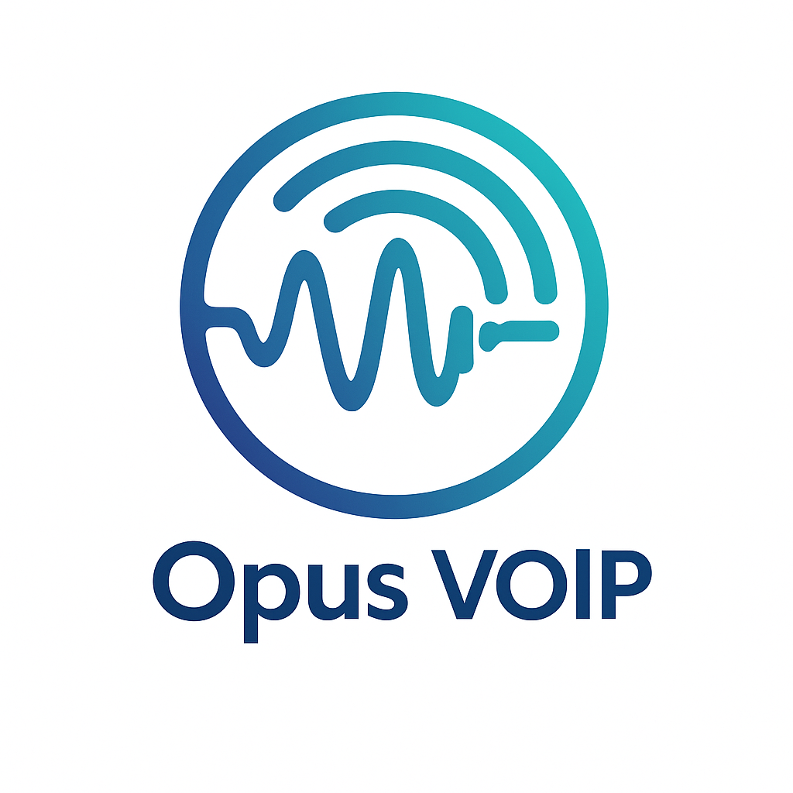

# VoIP + Opus — Learn and Call

[](https://github.com/avi892nash/voip-opus-test/actions/workflows/ci.yml)
[](https://github.com/avi892nash/voip-opus-test/releases/latest)

An interactive, installable website where anyone can:

1. **Learn** how a voice call actually travels over the internet — a 7-step
   tutorial with live audio visualizations, real Opus encodings to compare at
   different bitrates, an SVG of Opus's internal SILK/CELT split, and a
   timeline of how Opus came to exist (cited to RFC 6716 et al).
2. **Test** what Opus does to audio in their own browser — record yourself,
   hear the round-tripped result through real libopus-via-WASM, download both
   the original WAV and the encoded .opus, see the exact JS code that did it.
3. **Call** another user 1:1, or **spin up a group room** and talk to up to ~5
   people at once. Audio is peer-to-peer over Opus; the server only does the
   SDP/ICE handshake.

Installable as a PWA, mobile-first, ships with login + persistent users.

## Quick start

```bash
cp .env.example .env       # local defaults are fine
docker compose up --build  # web on :5174, server on :8000
```

Open <http://localhost:5174>, sign up in two different browsers (or one browser
+ a phone on the same Wi-Fi at `http://<your-lan-ip>:5174`), go to **/call**
and either click "Start a room" then share the link, or use the 1:1 flow.

### Without Docker

```bash
# Backend
python3 -m venv .venv && source .venv/bin/activate
pip install -r server/requirements.txt
uvicorn server.main:app --reload  # http://localhost:8000

# In another terminal — frontend
cd web && npm install && npm run dev  # http://localhost:5174
```

## Layout

```
voip-opus-test/
├── web/        React 19 + Vite 5 + Tailwind PWA  (learn, demo, call)
├── server/     FastAPI backend (auth + WebSocket signaling)
├── docs/       ARCHITECTURE.md · PROTOCOL.md · DEPLOY.md
├── docker-compose.yml
├── .env.example
└── README.md
```

Everything else (the old `intro/`, `app/`, `libopus/`, broken test scripts, the
Windows-only Opus binaries) has been removed — the modern `opus-recorder` WASM
module runs in any browser, and the new `server/` rewrite replaces all of the
old Python.

## Tests

```bash
.venv/bin/python -m pytest server/tests/   # 21 tests: auth, 1:1 signaling, rooms
```

## Documentation

- **[docs/ARCHITECTURE.md](docs/ARCHITECTURE.md)** — full implementation guide:
  system diagrams, frontend + backend module maps, sequence diagrams for
  signup / 1:1 calls / 3-person mesh / disconnect, trust boundary, data model,
  build-run-test, and known limitations. **Start here.**
- [docs/PROTOCOL.md](docs/PROTOCOL.md) — exact WebSocket message reference.
- [docs/DEPLOY.md](docs/DEPLOY.md) — three deploy paths (managed, single VM, or
  Pi + Cloudflare Tunnel via the .deb pipeline below).

## Operational scripts

For self-hosted deploys (a Raspberry Pi or any home/rented box). See
[docs/DEPLOY.md → Path C](docs/DEPLOY.md#path-c--single-deb-on-a-pi-behind-cloudflare-tunnel-)
for the full walkthrough.

| Script | Purpose |
|---|---|
| `scripts/build-deb.sh`      | Build the frontend, stage the layout, run fpm → `dist/voip-opus_X.Y.Z+sha_all.deb`. |
| `scripts/backup.sh`         | WAL-safe SQLite snapshot, gzip, rotate. Cron daily. |
| `scripts/restore.sh`        | Atomic restore from a `backup.sh` file, with safety checks. |
| `scripts/voip-opus.service` | systemd unit for the backend. Binds to `127.0.0.1`; sandboxed via `Protect*` directives. |

## Releasing

This repo uses **conventional commits** + **semantic-release**. Workflow:

1. Open a PR. CI runs commitlint, lints the frontend, runs the backend
   tests, builds the .deb, installs it on the runner, and smoke-tests the
   signup → /me → SPA-root path. PR cannot merge until all green.
2. Merge to `main`. The `release` job in
   [`.github/workflows/ci.yml`](.github/workflows/ci.yml) re-runs the whole
   pipeline, then runs `semantic-release`. semantic-release:
   - Reads conventional commits since the last tag.
   - Computes the next semver (`feat:` → minor, `fix:` → patch, `BREAKING
     CHANGE:` → major).
   - Bumps `package.json` + `web/package.json`, updates `CHANGELOG.md`,
     commits + tags, creates a GitHub Release with notes.
   - Attaches the built `.deb` to the release.
3. The post-release workflow
   [`.github/workflows/test-release.yml`](.github/workflows/test-release.yml)
   downloads the published .deb on a fresh runner, installs it, and re-runs
   the smoke test. Catches "the .deb that shipped to the public is
   different from the one CI built".

Commit-message style:

| Prefix    | Bumps      | Use for |
|-----------|------------|---------|
| `feat:`   | minor      | new visible feature |
| `fix:`    | patch      | bug fix |
| `perf:`   | patch      | observable performance change |
| `refactor:` | no bump  | internal rewrite, no behavior change |
| `docs:`   | no bump    | docs / README only |
| `test:`   | no bump    | tests only |
| `build:` / `ci:` / `chore:` | no bump | tooling, deps, CI |
| `BREAKING CHANGE:` footer | major | API / on-disk format change |

## Stack

- **Frontend:** React 19, TypeScript 5.7, Vite 5, Tailwind CSS 3, Framer Motion,
  p5.js, opus-recorder (WASM), vite-plugin-pwa.
- **Backend:** FastAPI, uvicorn, SQLite, PyJWT, bcrypt, pytest.
- **Media:** browser-native WebRTC (Opus-over-RTP), Google STUN by default,
  pluggable TURN.
- **Topology:** 1:1 calls use a single peer connection. Group rooms use full
  mesh (every browser holds an `RTCPeerConnection` to every other browser).
  Mesh scales to ~5 participants comfortably.

## License

MIT — feel free to use this as a starting point for your own teaching project
or in-browser voice tool.
